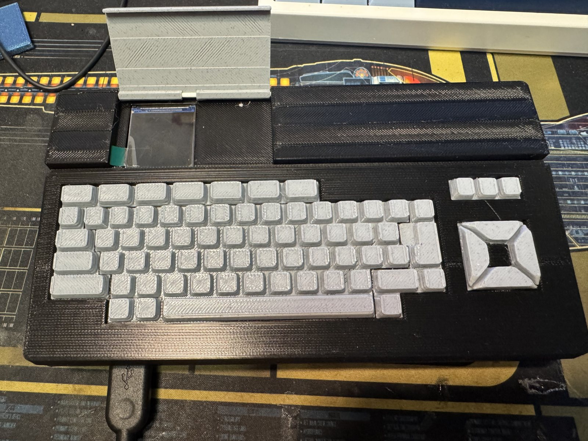
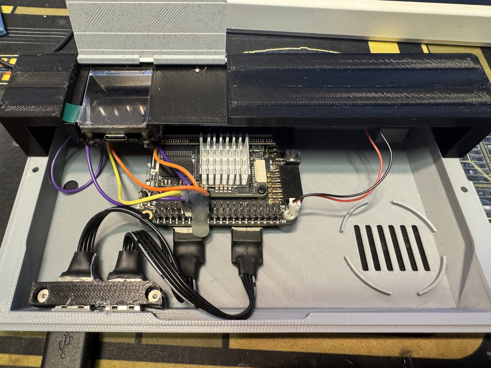
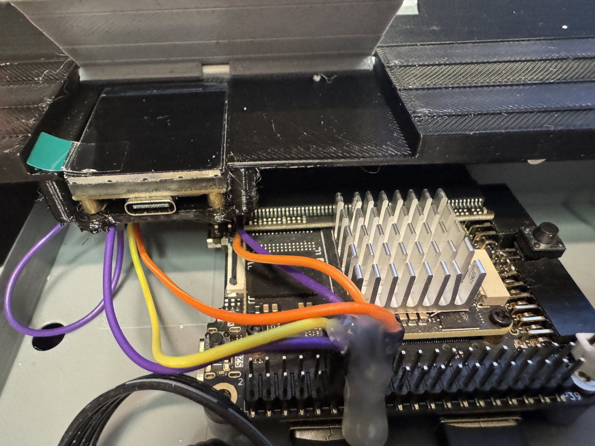
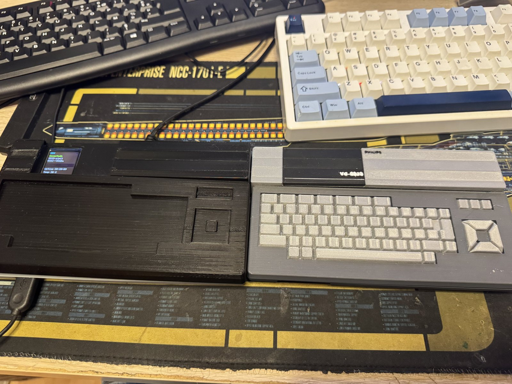

# La carcasa del MSXimus

Una carcasa para imprimir en 3D con la forma de un Spectravideo SVI-728, con la Tang Console 60K dentro, el ESP32-C6 con su pantalla en una bahía con tapa, ventilador, y los conectores sacados al exterior.

## Origen

Deriva de la **[Spectravideo SVI-728 Retropie case](https://www.thingiverse.com/thing:4066021)** de Palver en Thingiverse, una réplica del SVI-728 pensada para una Raspberry Pi, rediseñada aquí para la Console 60K. **El 3MF lleva todo lo necesario**: no hace falta bajar nada del original. La licencia del diseño original se aplica a lo que se conserva de él; conviene mirarla en la página de Thingiverse antes de redistribuir.

## Qué hay

| Fichero | Qué es |
|---|---|
| `MSXimus_carcasa.3mf` | El proyecto de **Bambu Studio** con las once piezas ya repartidas en cuatro platos y con los ajustes de impresión. Es lo que se abre y se imprime, y es la caja completa |
| `stl/` | Las mismas once piezas sueltas, en STL, para cualquier otro laminador |

Las piezas:

| Pieza | Para qué | Plato del 3MF |
|---|---|---|
| `placa_inferior` | **La tapa de abajo**: el suelo, con los postes donde se atornilla la Console 60K, la rejilla del ventilador y las salidas de los cables | 3 |
| `zona_pantalla` | **La tapa de arriba, parte trasera**: la bahía del ESP32-C6 con su pantalla, la ventana del ventilador y la ranura de los conectores | 1 |
| `tapateclado` | **La tapa de arriba, parte delantera**: el marco del teclado, donde se pegan las teclas | 4 |
| `tapacartucho` | La tapa con bisagra de la bahía de la pantalla, donde el SVI-728 tenía el cartucho; se levanta para ver la pantalla | 1 |
| `usb_conector_clamp_x1` | La brida que sujeta la extensión de dos USB-A al frontal | 2 |
| `key_1` a `key_4` (gris oscuro), `key_5` (gris claro), `cursor` | Las teclas del teclado y el cursor en cruz. **Van pegadas** al marco de `tapateclado` | 2 |

El teclado es decorativo: el MSXimus usa un teclado USB.

## Impresión

Los ajustes con que se imprimió la de las fotos, tal como van en el 3MF:

| | |
|---|---|
| Impresora | Bambu Lab X1 Carbon, boquilla de 0,4 mm |
| Material | PLA. Dos colores: gris claro para el suelo y las tapas, negro o gris oscuro para la tapa superior; las teclas en los dos grises |
| Altura de capa | 0,24 mm |
| Relleno | 15 % |

Cuatro platos. En cualquier otra impresora valen los STL con ajustes equivalentes.

## Montaje

- La **Console 60K** va atornillada a los postes del suelo, con el disipador hacia arriba y el conector J10 hacia la bahía de la pantalla.
- El **ESP32-C6** se sujeta en la bahía trasera con dos tornillos por su brida impresa y queda con la pantalla mirando hacia arriba, bajo la tapa, y el USB-C accesible desde dentro para grabarlo. Sus cables al J10 son los del [capítulo 02 del manual](../docs/manual/02-instalacion.md): 5 V, GND, TX, RX y, opcional, el turbo. Una vez probados, un poco de silicona sobre el conector del J10 los deja fijos.

- El **ventilador** de 20 mm va en la ventana trasera de la tapa, con su cable al conector de ventilador de la placa (el rojo y negro de la foto).
- **HDMI y USB**: latiguillos cortos de extensión llevan el HDMI y el USB de la placa a las ranuras traseras, y una extensión de dos USB-A con su brida sale al frontal izquierdo, para el teclado y el mando.

Y así queda junto a la carcasa VG-8020 del MSXnano, con la pantalla del C6 encendida:

