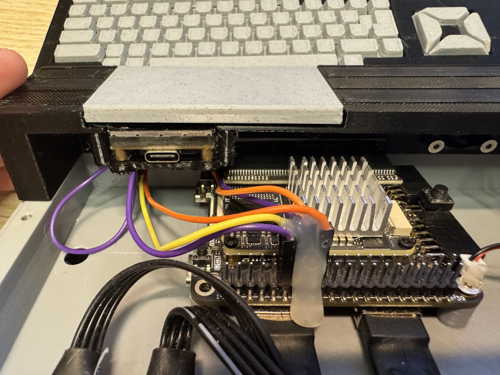
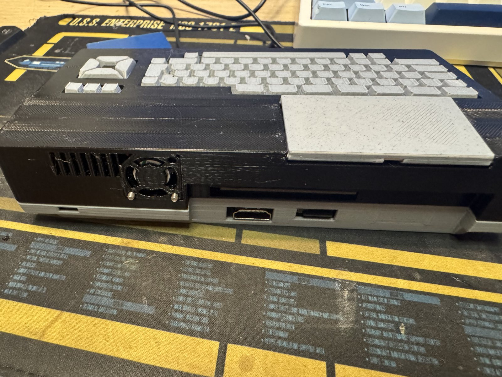

# 02. Instalación

Qué hay que grabar en la placa y con qué herramienta. Todo lo obligatorio va a la flash de la propia placa por el USB-C; las dos piezas aparte, el ESP32-C6 (opcional) y el BL616 (pendiente en el 138), tienen su propio procedimiento.

> **Aviso.** El MSXimus_138 es el porte del MSXimus a la Tang Console 138K: la misma placa base con el SOM Tang Mega 138K en vez del Mega 60K. Ninguna entrega del 138 se ha probado todavía en una placa 138K: el core está compilado y verificado en simulación, pendiente de placa. Lo que este capítulo cuenta como procedimiento es el del 60K trasladado al mapa de flash del 138; lo que se ve al encender (logo, menú, calibración de la DDR3) está pendiente de verificar en placa.

## 1. Lo que va a la flash de la placa

Tres ficheros, cada uno a una dirección distinta de la misma flash SPI de 16 MB del SOM:

| Fichero | Dirección | Obligatorio |
|---|---|---|
| El core, `msximus138_v3.x_dadoNNNN.fs` | **0x000000** | Sí |
| El pack de BIOS, `pack_bios_msximus*.bin` | **0x800000** | Sí, sin él la máquina no arranca |
| `yrw801.rom`, la ROM de ondas del MoonSound | **0x900000** | No, solo para tener el OPL4 completo |

Las direcciones **no son las del 60K** (allí el pack va en 0x400000 y el `yrw801.rom` en 0x500000): el bitstream del 138K ocupa unos 4,9 MB, el doble que el del 60K, y se comería un pack grabado en 0x400000. Por eso todo lo que va detrás del core está 4 MB más arriba. Los ficheros, en cambio, son los mismos: el pack y el `yrw801.rom` del 60K sirven tal cual, solo cambia la dirección donde se graban.

Cada entrega del 138 (`files/<fecha>/`, con su `LEEME`) trae los tres; el firmware del C6 va aparte, en su propio repositorio (sección 3). Con `yrw801.rom` sin grabar todo funciona igual, salvo la tabla de ondas del MoonSound.

**Herramienta**: el [Gowin Programmer](https://www.gowinsemi.com/en/support/download_eda/). En el 60K vale el que viene con el IDE 1.9.12; para el 138K, el que acompaña a la edición Standard 1.9.12.03 con licencia, que es la que hace falta para compilar el core (la Education no soporta el GW5AST-138). Que el Programmer suelto, sin licencia, reconozca y grabe el 138K está pendiente de verificar en placa.

### Cómo grabar

1. Conecta la placa por USB-C y abre el Gowin Programmer.
2. Deja que detecte el dispositivo: debe decir **GW5AST-138**.
3. Para cada uno de los tres ficheros, configura una operación de escritura en la **flash SPI externa** (las opciones que empiezan por *exFlash*, no las de SRAM), elige el fichero como *Programming File* y escribe **la dirección de la tabla** en el campo de dirección de inicio.
4. Graba primero el core y luego los otros dos. El orden no importa; **las direcciones sí**: si el pack no cae exactamente en 0x800000, la máquina arranca a pantalla negra.
5. **Apaga y enciende la placa.** Un reset no basta: la DDR3 necesita calibrar en frío y, en el 60K, puede quedarse colgada tras un reset en caliente (en el 138, misma IP y mismo motor de reintentos, pendiente de verificar en placa).

Si al encender solo hay una pantalla azul, es casi siempre el pack en una dirección equivocada o que falta el apagado y encendido.

Cada entrega del core viene con dos ficheros del mismo bitstream: el `.fs` y un `_jtag.bin`. Para el Gowin Programmer vale el `.fs`. El `_jtag.bin` es el mismo contenido en formato binario para cargar por JTAG (en el 60K es el que usa el flasheador del BL616; en el 138, sin firmware del BL616 todavía, queda como carga por JTAG).

El nombre del dispositivo en las entregas dice con qué versión del chip se compiló el core: **GW5AST-138B** o **GW5AST-138C**. Sipeed monta chips versión C desde julio de 2025; la serigrafía del chip del SOM dice cuál lleva cada placa.

### El pack de BIOS

Hay dos packs iguales en todo salvo el kernel de disco que llevan dentro:

| Pack | Nextor |
|---|---|
| `pack_bios_msximus.bin` | **2.1.4**, el estable, el que quieres |
| `pack_bios_msximus_nextor3.bin` | **3.0 beta 1**, para probar la beta |

Y de cada uno, una variante internacional y una japonesa, que cambian la BIOS y la SubROM. Quien prefiera montar el pack con sus propias ROMs tiene el [Pack Builder del MSXnano](https://github.com/Papipapito/MSXnano), que las ensambla con Nextor incluido. El [capítulo 04 de la referencia técnica](../tecnica/04-pack-bios.md) describe qué lleva y en qué orden.

Un mismo pack sirve para cualquier core del 138 (y para los del 60K desde la versión 3.5c): el menú y el driver de disco sondean el core y usan lo que tenga.

### Después de grabar

En una placa recién grabada la máquina arranca en el navegador de la tarjeta. Quien prefiera que arranque directamente en el MSX, como un ordenador de siempre: **S** durante el logo, desmarcar **Menú al arrancar** y **Save & Restart**. Es un ajuste guardado en la flash, sobrevive a los apagados, y se vuelve a activar marcándolo. El [capítulo 04](04-menu.md) cuenta el menú entero.

Con eso, una microSD con ROMs y discos, y ya está. El [capítulo 03](03-tarjeta-sd.md) explica cómo prepararla.

## 2. El panel F12: el BL616 (pendiente)

La Console 138K lleva, como la 60K, un microcontrolador **BL616** cableado a la FPGA de fábrica. En el 60K, con un firmware propio, dibuja un panel de estado sobre la imagen del MSX cuando se pulsa **F12**: versión del core, CPU y turbo, tarjeta, ventilador, teclado, red y dos filas de diagnóstico del USB del propio BL616. Con F12 otra vez, el juego sigue donde estaba. Es de solo lectura: no hay menú ni cursor.

**Ese firmware no se ha compilado para la 138K.** La Console 138K trae su propio *partner firmware* de Sipeed, y de momento se queda tal cual: el MSX funciona igual sin el panel, y la línea serie entre los dos chips está en la placa base, así que no hay que tocar nada en hardware cuando llegue. La release del 138 no trae ningún `.bin` del BL616. Como en el 60K, el turbo va en **F11**, para dejar la F12 libre.

Cuando exista, el procedimiento será el del 60K: mantener pulsado **BOOT** mientras se conecta el USB (modo ISP, que vive en la ROM del chip y no se puede estropear), localizar el puerto COM nuevo y grabar con **BLDevCube** (el [Bouffalo Lab Dev Cube](https://github.com/bouffalolab/bouffalo_sdk)) las dos imágenes, la de Sipeed en 0x0 y la del panel en 0x40000. Las direcciones y la imagen partner de la 138K quedan pendientes de verificar en placa.

## 3. La WiFi: el ESP32-C6 (opcional)

Sin él el core funciona igual; solo falta la red. El módulo es la Waveshare **ESP32-C6-LCD-1.3**, que además de la WiFi trae una pantalla de 240×240 donde se ve el estado.

### Cableado

Cuatro cables, o cinco con el indicador de turbo, entre el conector **J10** de la placa y el módulo. La placa base es la misma que la de la Console 60K, así que el conector y los pines son los mismos; los pines `esp_*` del SOM 138K son copia bola a bola de los del 60K, sin contrastar todavía contra el esquemático (pendiente de verificar en placa):

| Pin J10 | Señal | Lado del C6 |
|---|---|---|
| **11** | +5 V | **5V**, tira derecha, el último |
| **12** | GND | **GND**, tira derecha |
| **14** | TX, FPGA → C6 | **IO17**, tira izquierda |
| **16** | RX, FPGA ← C6 | **IO16**, tira izquierda |
| **18** | Turbo, FPGA → C6 | **GPIO3**, tira derecha, el primero. Opcional: solo alimenta el indicador de la pantalla |

- **J10 es el conector 2×20 libre**, el que Sipeed llama *SDRAM1 CONN.* en el esquema. No es el que lleva el módulo SDRAM del core.
- **Sin serigrafía**: con la placa apagada y un polímetro en continuidad, **el pin 12 es el único de todo el conector con camino a masa**. Su compañero de fila es el 11, y desde el 12 hacia el lado largo del conector, el que deja catorce filas y no cinco, vienen el 14, el 16 y el 18. Un cable plano de una hilera en esa columna resuelve todo.
- La alimentación sale del propio J10. El USB-C del módulo solo hace falta para grabar su firmware.
- **Mejor no tener las dos alimentaciones a la vez.** El módulo tiene protección, pero al grabar por USB-C conviene soltar el cable de 5 V o apagar la placa.
- TX y RX van cruzados. La línea va a 859372 baudios.
- Si algún día se pincha un segundo módulo SDRAM en J10, el ESP tiene que mudarse.

### El firmware del C6

Vive en su propio repositorio, [ESP32-for-FPGA](https://github.com/Papipapito/ESP32-for-FPGA); el mismo binario sirve para el MSXimus del 60K, para el del 138K y para el MSXnano. La release trae el binario fusionado, `firmware_esp32c6_*_merged.bin`, que se graba por el **USB-C del módulo**, sin Arduino y sin compilar nada:

- **Desde el navegador**, sin instalar nada: [esptool-js](https://espressif.github.io/esptool-js/), el flasheador web de Espressif, en Chrome o Edge. Conectar, elegir el fichero, dirección 0x0, Program.
- **Por línea de órdenes**, si ya se tiene esptool:

```bash
esptool --chip esp32c6 --port COMx write_flash 0x0 firmware_esp32c6_merged.bin
```

No hay ruta de arrastrar y soltar como en una Raspberry Pi Pico: el ESP32 no tiene cargador de almacenamiento masivo en ROM. El flasheador web es lo más parecido.

Con el módulo cableado y con firmware, la pantalla enseña el logo MSX al encender y luego el estado: red, turbo, reloj. La red se configura desde el MSX con la tecla **W** del menú ([capítulo 07](07-wifi-file-hunter.md)).

Así queda montado dentro de la carcasa impresa, en la foto sobre una Console 60K, que comparte la placa base: el módulo en su bahía con el USB-C accesible, y los cables al J10 de la placa, fijados con silicona para que no se muevan:

<p align="center"></p>

## 4. La carcasa (opcional)

Hay una carcasa para imprimir en 3D con la forma de un Spectravideo SVI-728: la placa atornillada al suelo, el ESP32-C6 con su pantalla en una bahía con tapa, el ventilador en la trasera, HDMI y USB sacados atrás y dos USB-A al frontal. Está diseñada sobre la Console 60K; como la 138K es la misma placa base con otro SOM, debería servir igual (pendiente de verificar en placa). El proyecto de Bambu Studio, los STL, los ajustes de impresión y las notas de montaje están en [`carcasa/`](../../carcasa/README.md).

<p align="center"></p>

## 5. Actualizar

Un core nuevo se graba igual que la primera vez, solo el `.fs` en 0x000000, y apagar y encender. Un pack nuevo, solo el pack en 0x800000. Los ajustes guardados se conservan: el pack mide 512 KB justos y los bytes de configuración que van detrás, en 0x880000, no los toca el programador (once bytes desde la 3.7; las v1 y v2 del 138 usaban seis). En una placa recién grabada esos bytes están vacíos y el core arranca con los valores de fábrica, con el menú al arrancar activado; el primer Save & Restart los escribe. El `yrw801.rom` no cambia entre versiones.

Ojo al pasar un core del 60K al 138K o al revés: son bitstreams distintos para chips distintos, y el mapa de flash no coincide. Un pack grabado para el 60K en 0x400000 queda debajo del bitstream del 138K y hay que volver a grabarlo en 0x800000.
