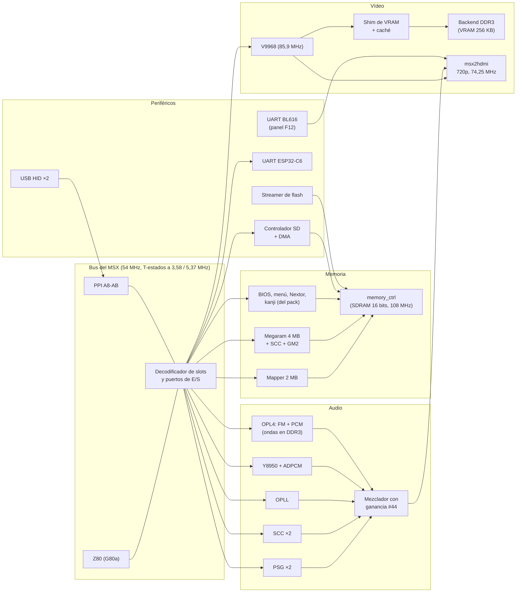

# 01. Arquitectura del core

Cómo está montado el MSXimus por dentro: qué bloques hay, cómo se conectan, con qué relojes van y qué pasa desde que se enciende la placa hasta que el Z80 ejecuta su primera instrucción. Todo sale de `fpga/top.v` y de los módulos que instancia; los números están tomados del RTL tal como se sintetiza.

## 1. La placa y lo que se usa de ella

El MSXimus corre en la **Sipeed Tang Console 60K**, una placa con un módulo SOM que lleva la FPGA **Gowin GW5AT-60** y una **DDR3** de la que el core usa dos regiones. En la placa base hay una **SDRAM Winbond W9825G6KH** de 16 bits, la ranura de la tarjeta SD, dos puertos USB-A, el HDMI, el conector 2×20 libre donde va el ESP32-C6 y un microcontrolador **BL616** que hace de programador y de canal de servicio.

| Recurso | Para qué lo usa el core |
|---|---|
| SDRAM externa de 16 bits | Toda la memoria del MSX: BIOS y ROMs del pack, mapper de 2 MB, megaram de 4 MB, fuente kanji, driver de disco. Mapa en el capítulo 03 |
| DDR3 del SOM | La VRAM del V9968 y la tabla de ondas de 2 MB del OPL4. Dos clientes independientes, cada uno con su propio controlador |
| Flash QSPI de 8 MB | El bitstream, el pack de BIOS de 512 KB, seis bytes de configuración y la ROM de ondas YRW801 |
| Tarjeta SD | Discos y ROMs del usuario, con su propio controlador en el core (capítulo 06) |
| BL616 | Flasheo por JTAG, y una UART con el core para el panel de estado F12 sobre el HDMI |
| ESP32-C6 externo | WiFi UNAPI y pantalla de estado, por UART a unos 860 kbps |
| USB-A ×2 | Teclado, ratón y mando, con un host USB HID propio en el fabric, sin hub |

La flash está compartida con el BL616 y el bitstream ocupa hasta 4 MB, por eso el pack de BIOS va en 0x400000 y no en 0x200000 como en el MSXnano.

## 2. Diagrama de bloques

Todo lo que toca la SDRAM pasa por un único controlador, `memory_ctrl`, que reparte turnos entre la CPU y los clientes secundarios. El V9968 no toca la SDRAM: su VRAM vive en la DDR3 a través del shim.

## 3. Relojes y dominios

Un solo PLL principal genera el árbol del MSX a partir del oscilador de 50 MHz de la placa. El vídeo y la DDR3 tienen sus propios PLL, a propósito: así el HDMI no comparte nada con el bus del MSX y los cruces se reducen a FIFOs y sincronizadores.

| Reloj | Frecuencia | Quién lo usa |
|---|---|---|
| `clk_108m` | 108,000 MHz | El controlador de SDRAM |
| `clk_54m` | 54,000 MHz | El Z80 y todo el bus del MSX: slots, puertos, PPI, PSG, SCC, mezclador, SD |
| `clk_27m` | 27,000 MHz | Registros de configuración, RTC, OPL3, UART del ESP, cronómetro de la SD, streamer de flash |
| `clk_135` | 135,000 MHz | Serializadores TMDS heredados (el HDMI real va por la cadena de vídeo) |
| `clk_wave375` | 37,500 MHz | Motor PCM del OPL4 |
| `clk_86` | 85,909 MHz | El V9968 y su shim de VRAM. Es 27 × 35/11, cero ppm respecto a 24 veces la subportadora de color |
| `clk_hdmi` / `clk_hdmi5` | 74,25 / 371,25 MHz | Píxel y TMDS ×5 del 720p, de una cascada 50 → 27 → 74,25 calcada de la plantilla de nand2mario para esta placa |
| DDR3 | 297 MHz | Dos controladores independientes, uno para la VRAM y otro para las ondas del OPL4, con el reloj de calibración desde el pad de 50 MHz |

El Z80 no va a 3,58 MHz: va a 54 MHz con habilitaciones de reloj que dibujan los T-estados. El divisor normal es 108 ÷ 30 = 3,6 MHz; el turbo es 108 ÷ 20 = 5,4 MHz con un pulso tragado cada 176, que da 5,369318 MHz exactos, la receta del turbo de Panasonic. El cambio entre los dos se hace sin glitch, solo cuando el bus está en reposo y la SDRAM libre.

Dos frenos deliberados mantienen la velocidad de un MSX real: un estado de espera en cada búsqueda de opcode (M1) y otro en cada escritura a memoria. En turbo la latencia de la SDRAM y su refresco no caben en un T-estado de 186 ns, así que hay una guarda que cuesta un 18 % del turbo teórico; se probó a quitarla y la máquina se colgaba.

## 4. El bus del MSX

El Z80 es un **G80a**, la variante del T80 en Verilog, en modo Z80 con ciclos de E/S estándar. El bus que sale de él es el de un MSX de cuatro slots primarios, dos de ellos expandidos:

| Slot | Contenido |
|---|---|
| 0-0 | BIOS principal (32 KB) |
| 0-2 | ROM del driver de red UNAPI (16 KB, página 1) |
| 0-3 | ROM del logo de arranque (16 KB, página 1) |
| 1 | Segundo SCC o Game Master 2, según Ajustes; libre si no |
| 2 | Megaram: el cartucho emulado, con su SCC, una vez que el menú lanza una ROM |
| 3-0 | Mapper de RAM de 2 MB |
| 3-1 | SubROM (página 0), menú con FM-BIOS (página 1), segunda página del menú (página 2) |
| 3-2 | ROM del disco: Nextor y la ventana de la SD |
| 3-3 | Megaram en su posición de arranque, antes de lanzar nada |

La decodificación es la clásica: el registro de slot primario está en el puerto A del PPI y los registros de slot secundario en FFFFh de cada slot expandido. Todos los `*_req` que salen del decodificador están registrados en `clk_54m` y son mutuamente exclusivos; el mux de lectura del bus es un OR plano de esas peticiones. No es cosmética: con la FPGA al 98 % de celdas lógicas, los nodos IORQ_n y WR_n del Z80 están saturados y cualquier cono combinacional colgado de ellos aparece en la lotería de rutado.

Las señales del bus que llegan a módulos en otros dominios se registran antes: el módulo de red y el V9968 ven el bus un ciclo tarde, y el glue del V9968 lo convierte en una transacción valid/ready por ciclo de E/S.

## 5. La memoria

`memory_ctrl` gobierna la SDRAM externa a 108 MHz. Es el controlador del MSXnano adaptado al bus de 16 bits: en cada turno sirve un byte, con la máscara DQM sacada del bit 0 de la dirección. Los turnos se reparten con un divisor libre de 108 ÷ 8 y ÷ 16 que marca las ranuras de CPU a 6,75 MHz, y los huecos vacíos los aprovechan dos puertos secundarios, `wv` para las ondas y `wv2`/`wv3` para el V9968 cuando la VRAM va por SDRAM en la línea de respaldo.

La dirección física de 23 bits se elige en un mux de dos ramas. La rama normal es la de la CPU: mapper, BIOS, megaram, Game Master 2, kanji, menú y logo, cada uno con su región del capítulo 03. La otra rama es el **camino de streaming**, activo cuando la CPU está parada: por él escriben el streamer de la flash al arrancar y la DMA de la SD. La elección entre esos dos va por debajo, sobre registros, fuera del cono de la CPU, que es donde vive el 98 % de la congestión.

El refresco de la SDRAM tiene dos modos. Con la CPU en marcha lo dispara la señal RFSH del Z80. Con la CPU parada entra un refresco autónomo, y ahí hay una regla dura aprendida a base de fallos: el refresco autónomo solo puede correr cuando se sabe que nadie está escribiendo, porque puede pisar una aceptación en vuelo. Por eso la señal `cpu_run` que lo gobierna junta el reset del Z80, el fin del streaming de flash, el arranque del ESP, la congelación del panel F12 y la ventana de espera de la DMA, y desde la V3.6d va registrada.

## 6. El vídeo

El VDP es el **V9968** de Takayuki Hara, el superconjunto del V9958 con comandos rápidos, paleta de 5 bits, sprites en modo 3 y VRAM de 256 KB. Va en su propio dominio de 85,9 MHz. El capítulo 05 cuenta su procedencia y su estado; aquí, cómo encaja:

1. **Glue del bus**. El V9968 espera un interfaz valid/ready. El glue registra el bus del Z80 y emite una transacción por ciclo de E/S en 98-9B (y en 88-8B, que se aliasa al mismo chip para el software que busca un V9968 como cartucho externo).
2. **Shim de VRAM**. El core pide la VRAM con un contrato de ocho ciclos. El shim la sirve con una caché de línea y prefetch y traduce las peticiones a palabras de 32 bits con máscara de bytes hacia el backend. Dos canales en paralelo, porque los modos de 256 bytes por línea consumen una palabra cada 730 ns y un canal solo no llegaba.
3. **Backend DDR3**. La VRAM vive en la DDR3 del SOM, con un controlador propio calcado del framebuffer de nand2mario para esta placa. Existe una línea de respaldo con la VRAM en la SDRAM compartida, que serializa cada palabra en hasta cuatro accesos al controlador de memoria; se conserva pero no es la que se entrega.
4. **msx2hdmi**. El puente al HDMI de 720p a 60 Hz. El HDMI corre en su dominio de 74,25 MHz y se alimenta del VDP a través de un anillo de 32 líneas en BRAM de doble reloj; la captura se auto-alinea con las señales reales de sincronismo y blanking del VDP. El audio va embebido en el mismo HDMI. Sobre esta imagen el BL616 puede superponer el panel de texto de la tecla F12.

Solo hay salida de 60 Hz. La geometría de 50 Hz del V9968 no está medida.

## 7. El audio

Siete generadores entran en un mezclador con saturación en `clk_54m`:

| Chip | Puertos | Implementación |
|---|---|---|
| PSG YM2149 | A0-A2 | Con filtro de paso bajo, y el registro 14 sirve el joystick USB |
| Segundo PSG | 10-12 | El mismo módulo, para el software que lo busca ahí |
| SCC / SCC+ | En la megaram, 9800h y B800h | `scc_wave2` en Verilog puro; el VHDL original lo barría la síntesis de la GW5A |
| Segundo SCC | Slot 1 | El mismo módulo, en el slot que no ocupa la megaram |
| OPLL YM2413 | 7C-7D | `jt2413` de JOTEGO |
| Y8950 MSX-Audio | C0-C1 | `jtopl2` más un decodificador ADPCM-B con 32 KB de muestras en BSRAM y su IRQ al Z80 |
| OPL4 MoonSound | C4-C7 y 7E-7F | FM con `opl3_fpga` y motor PCM `YMF278B` de 24 slots con las ondas en la DDR3, cargadas de la flash en segundo plano tras el arranque |

El grupo clásico pasa por una ganancia maestra ajustable de 0 a 7 por el puerto #44, guardada en la flash; el OPL4 entra después de esa ganancia, a nivel nativo, porque la ganancia existe justamente para subir los chips flojos a la altura del MoonSound. El OPLL entra atenuado a tres cuartos para igualar el balance medido en openMSX entre su portadora y la del Y8950. Hay salida mono y estéreo, según Ajustes.

## 8. Periféricos

- **Teclado, ratón y mando USB**, por los dos USB-A: dos instancias del host USB HID en el fabric, con un PLL de 12 MHz propio, sin hub. El teclado se traduce a la matriz del MSX; el ratón se presenta por el puerto de joystick como un ratón MSX; el mando (desde la v3.6f) sale del host como una palabra de doce bits en formato SNES (4 arriba, 5 abajo, 6 izquierda, 7 derecha, 8 A, 0 B, 10 y 11 los hombros) y va al puerto 1 del registro 14 del PSG, con autodisparo en los botones 3 y 4. El host es HID puro con el informe de los mandos genéricos (ejes a 00/7F/FF): un mando **XInput** (Xbox y los receptores que lo imitan) no es HID y no se ve. El BL616 tiene su propio host USB en el USB-C OTG y su firmware entiende XInput, pero exige un hub o adaptador OTG con alimentación en el puerto donde normalmente va el cargador; el MSXimus no cuenta con él para los mandos.
- **Reloj de tiempo real** en B4-B5, alimentado por el reloj del sistema.
- **Fuente kanji** por los puertos D8-DB, con los 256 KB de JIS1 y JIS2 en la SDRAM.
- **S1990 del turbo R** en E4-E7: la máquina se identifica como turbo R y la rutina CHGCPU de la BIOS mueve el turbo. No hay R800.
- **ESP32-C6** por los puertos 06-07: el puente `wifi_lite` es una UART con FIFO de recepción de 2080 bytes, prescaler fijo 27 ÷ 31 = 870968 bps (el firmware del ESP va a 859372, un 1,3 % menos, dentro de la tolerancia de una UART), y "recepción rápida" que retiene la lectura hasta 25 ms cuando el FIFO está vacío.
- **BL616**: el core le manda su estado por UART y él dibuja el panel F12 sobre el HDMI. Mientras el panel está abierto, el MCU congela el Z80 parando su `cpu_run`, sin resetearlo.
- **Tira de ocho LEDs WS2812**: diagnóstico. El LED de red parpadea con el tráfico de la UART del ESP.
- **Ventilador** por temperatura (`fan_ctrl` + oscilador de anillo `ro_osc` como termómetro relativo).
- **Telemetría serie** (`dbg_uart` por E22 y la UART del USB-C): contadores del shim del V9968, la DDR3, el audio y el ventilador; su periodo (`PERIOD_MS`) es el dado que siembra el placement de cada campaña.
- Los cuatro anteriores más el decodificador de teclado único forman la *dieta* de la v3.6h (`DIETA_V36H` en `top.v`, apagada): se probó y rutaba peor, ver el [capítulo 07](07-sintesis-campanas.md).
- **Ventilador** controlado por temperatura, con un oscilador en anillo como sensor.
- **UART de depuración** a 54 MHz por un PMOD, apagada en las entregas.

## 9. Qué pasa al encender

1. El PLL principal engancha. Un secuenciador de reset suelta tres etapas separadas 39 ms.
2. El **streamer de flash** copia el pack de BIOS, 512 KB más seis bytes, desde 0x400000 de la flash a la SDRAM, byte a byte por el camino de streaming. Al final lee los seis bytes de configuración: los dos registros de Ajustes, el byte de turbo al arrancar y el de ganancia. Con el botón S2 pulsado se cargan los valores de fábrica.
3. Mientras tanto la DDR3 calibra y, en cuanto el pack está en su sitio, el **cargador de ondas** empieza a copiar los 2 MB de la YRW801 desde 0x500000 a la DDR3, en segundo plano.
4. El core espera unos tres segundos a que el **ESP32** haya arrancado, para que el driver de red lo encuentre a la primera.
5. Cuando todo eso está, el Z80 sale de reset y arranca la BIOS del pack. El menú de la BIOS vive como cartucho en el slot 3-1 y toma el control en el escaneo de slots; lo que hace a partir de ahí lo cuenta el capítulo 04 del manual.

Un reset del MSX no repite el streaming: la SDRAM conserva su contenido, y por eso conserva también la megaram con la partida guardada, que es lo que permite el guardado de SRAM al siguiente arranque. Un apagado lo pierde todo.

## 10. Lo que no está

- No hay R800 ni MSX-DOS 2 en ROM; el identificador de turbo R sirve para el turbo y para el software que lo consulta.
- No hay salida analógica de vídeo ni de audio: todo va por el HDMI.
- No hay host USB en el ESP32-C6, por silicio; el teclado va por los USB de la placa.
- La variante con el V9958 original está eliminada del árbol; el V9968 es el único VDP.
